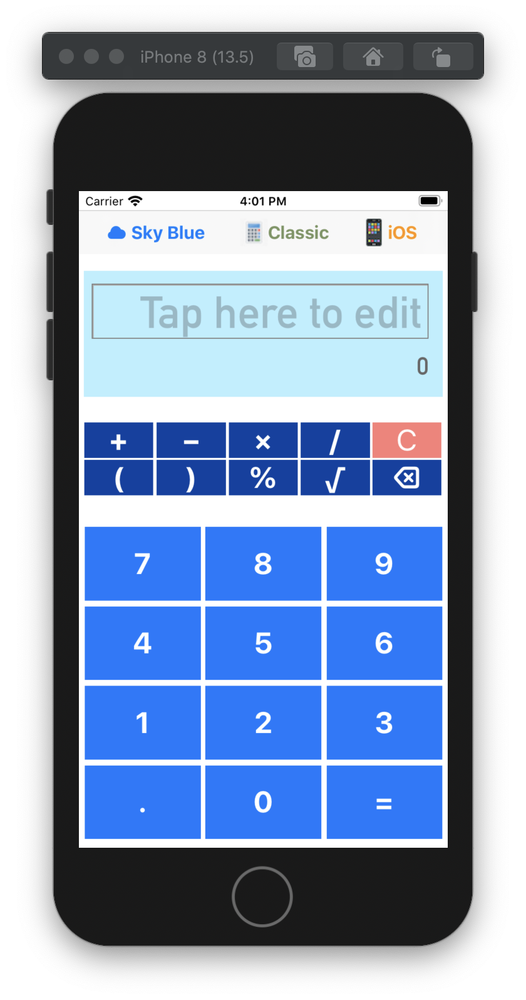
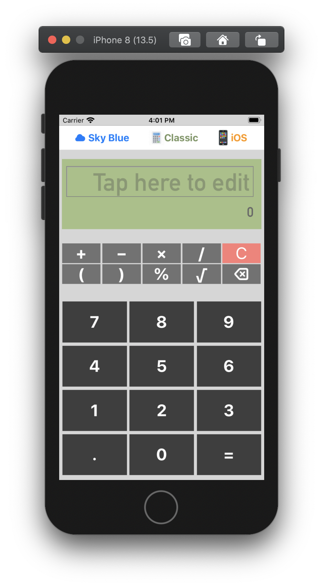
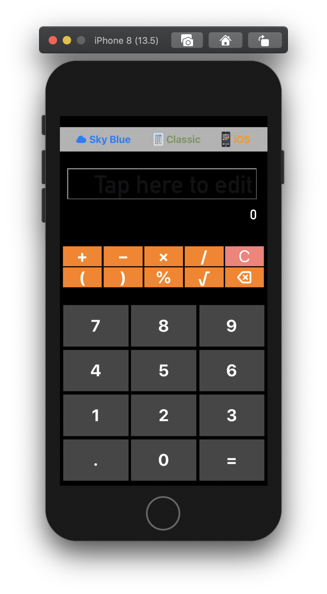

# basic_Calculator

## Introduction

It is a basic calculator app for iOS which provides basic arithmetic functions. The UI provides the following elements

 1. An editable text field for entering a math equation
 2. Twenty-two buttons for formula input/edit
 3. Three colour themes

## Layout

### Sky Blue Theme (default)

### Classic Theme

### iOS Theme

## Tested Devices

Layout is tested and displayed normally on iPhone 8, iPhone 8 Plus, iPhone 11 and iPhone 11 Pro Max.
